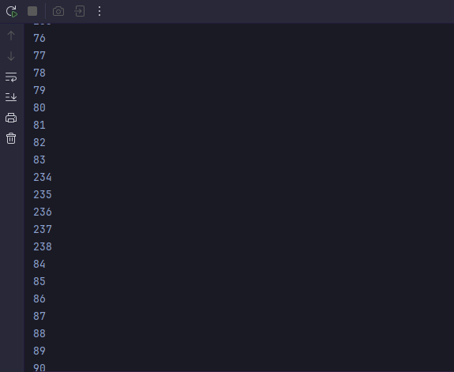
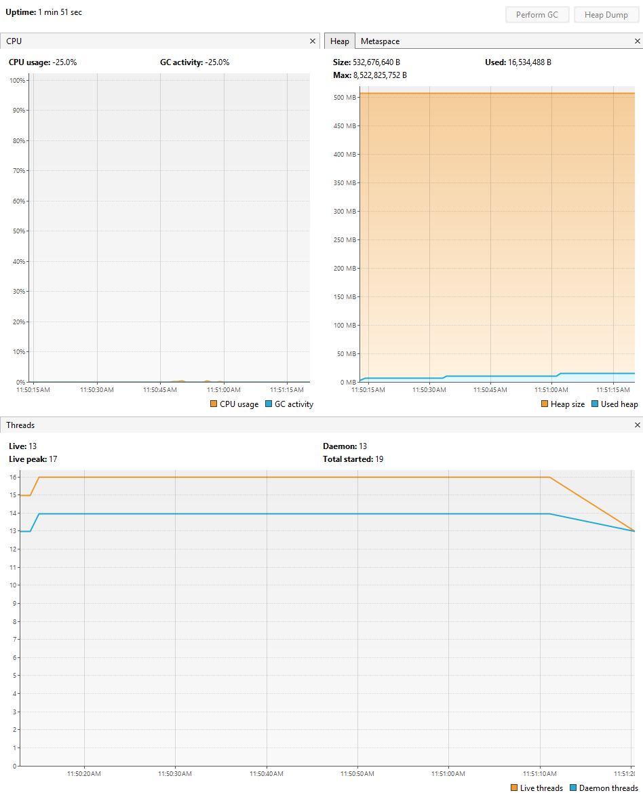
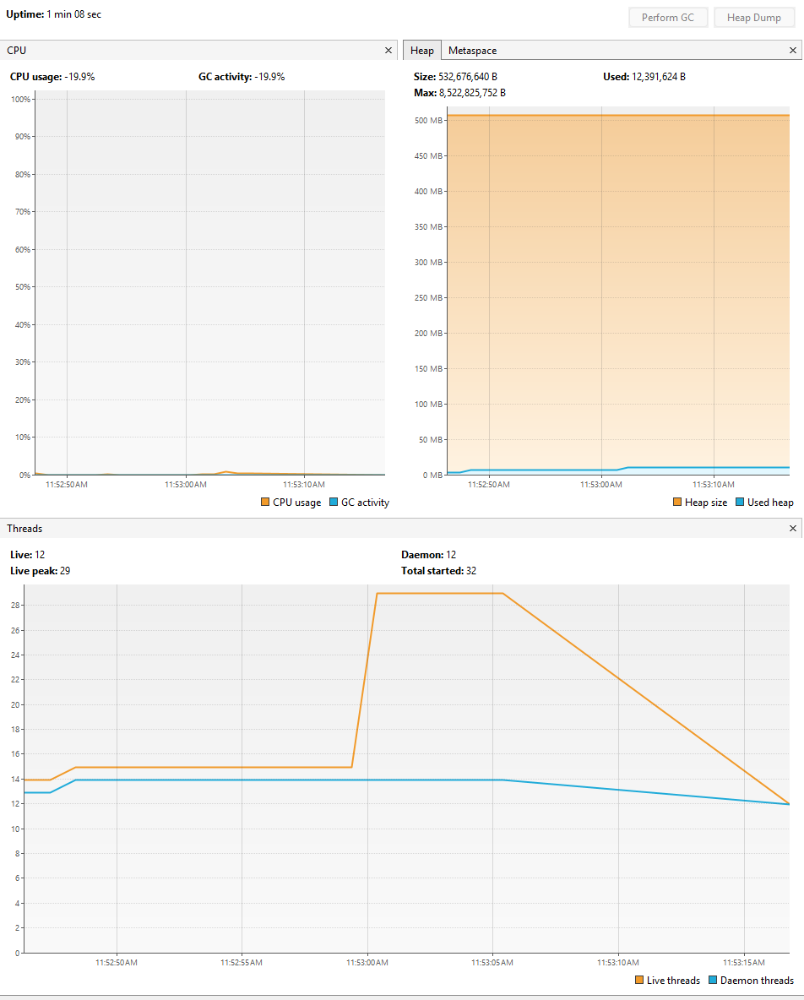
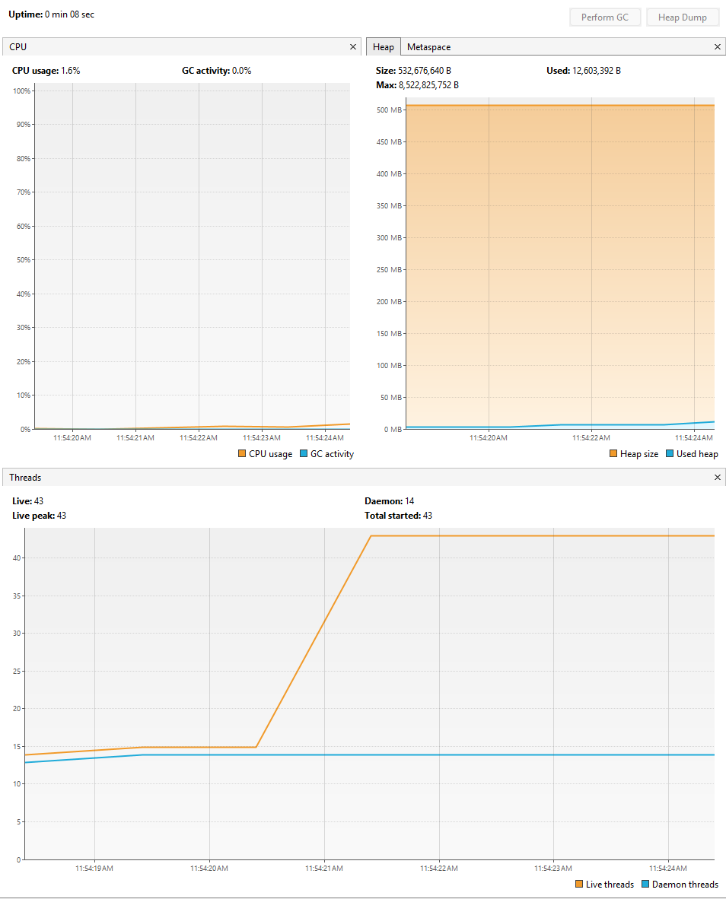
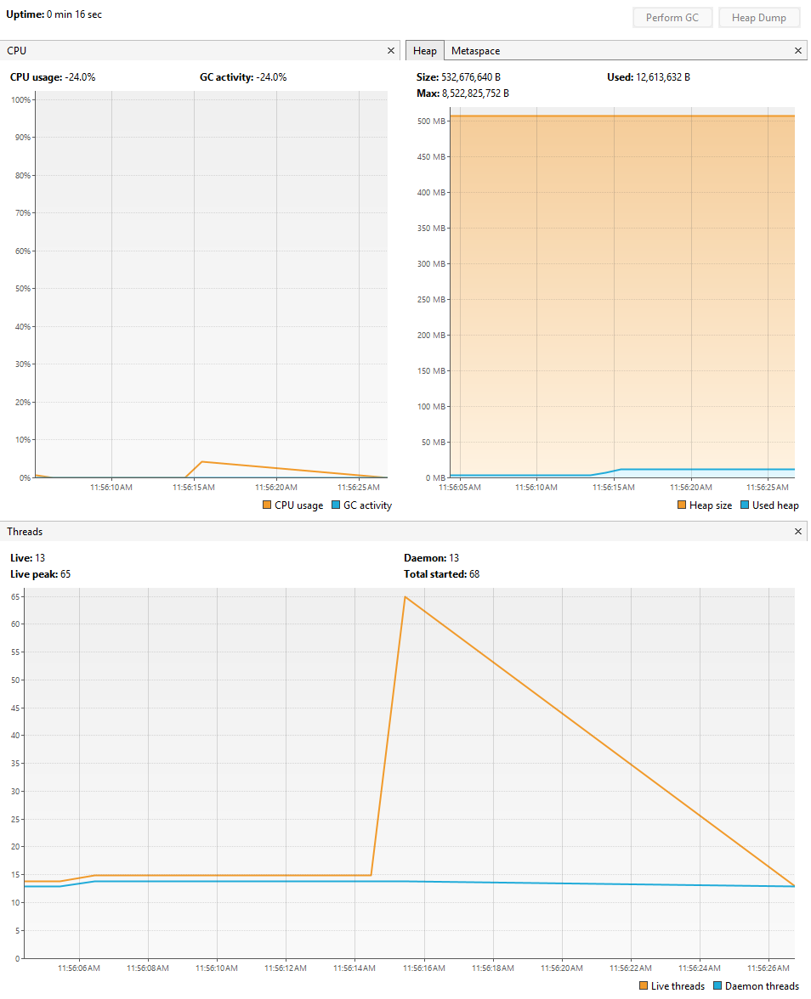
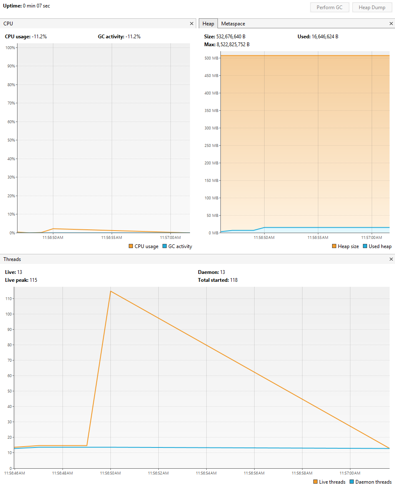
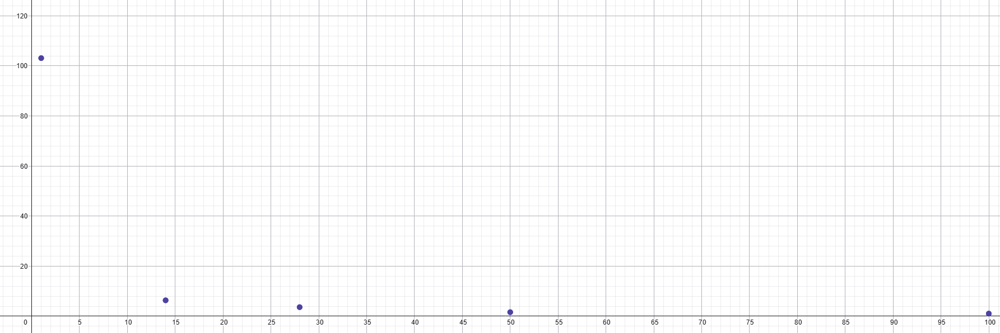
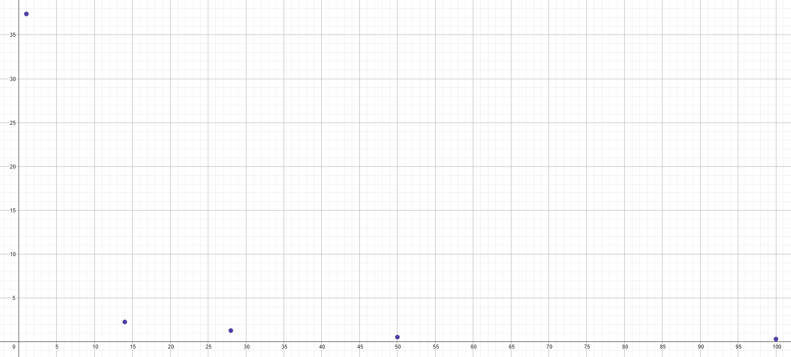
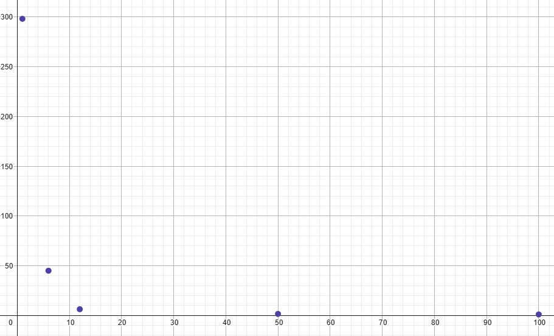
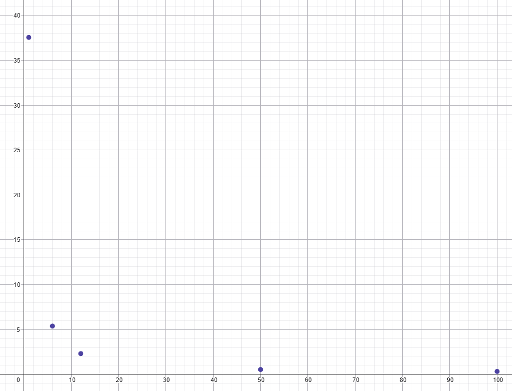

# 🏫 Escuela Colombiana de Ingeniería
## 📚 Arquitecturas de Software – ARSW
## ╰┈➤ - [ 🪼 ] | Ejercicio Introducción al paralelismo - Hilos - Caso BlackListSearch ┆⤿⌗

---

Nombres:
- Daniel Palacios Moreno 
- Sofia Nicolle Ariza Goenaga

---

## 📖 Dependencias
### 🔗 Lecturas recomendadas:
- [Threads in Java](http://beginnersbook.com/2013/03/java-threads/) *(hasta “Ending Threads”)*
- [Threads vs Processes](http://cs-fundamentals.com/tech-interview/java/differences-between-thread-and-process-in-java.php)

---

## 📝 Descripción
Este ejercicio introduce la **programación con hilos en Java** y su aplicación en un caso concreto de validación de direcciones IP en listas negras y un ejercicio inicial para aclimatar a los miembros del equipo que se presenta en los puntos siguientes.

---

## ⚙️ Parte I – Introducción a Hilos en Java
1. Completar la clase **`CountThread`** para definir el ciclo de vida de un hilo que imprima números entre A y B.
2. En el método **`main`** de **`CountMainThreads`**:
	- Crear 3 hilos con intervalos:
		- Hilo 1 → `[0..99]`
		- Hilo 2 → `[99..199]`
		- Hilo 3 → `[200..299]`
	- Iniciar con `start()`.
	- Revisar la salida.
	- Cambiar `start()` por `run()`. ➜ **Analizar diferencias y explicar.**

### Solución:

El archivo CountThread.java se diseña para que se construya con el rango necesario para que en el metodo run con un for simple se recorra el rango y se impriman los valores.
Para ver el [repositorio Sofia](https://github.com/Sofia-ariza-783/ARSW_Lab_I.git).

Cuando se cambia el start por run, el hilo se ejecuta en el hilo principal, por lo que se imprimen los valores en el orden correcto.
- **Con start:**

- **Con run:**

---

## 🔍 Parte II – Ejercicio Black List Search

### 🎯 Contexto
Se desarrolla un componente de **seguridad informática** que valida direcciones IP en miles de listas negras y reporta aquellas presentes en al menos **5 listas**.

### 🧩 Componentes principales:
- **`HostBlackListsDataSourceFacade`** → Fachada para consultar listas negras y reportar hosts peligrosos. *(Thread-Safe, NO modificable)*
- **`HostBlackListsValidator`** → Método `checkHost` que valida un host y reporta si es confiable o no.

📊 Ejemplo de LOGs:
- INFO: HOST 205.24.34.55 Reported as trustworthy
- INFO: HOST 205.24.34.55 Reported as NOT trustworthy

### 🚀 Tareas:
1. Crear una clase **Thread** que busque en un segmento de servidores y registre ocurrencias.
2. Modificar `checkHost(N)` para:
	- Dividir espacio de búsqueda en **N hilos**.
	- Ejecutar en paralelo y esperar con `join()`.
	- Sumar ocurrencias y reportar confiabilidad.
	- Mantener LOGs verídicos sobre listas revisadas.

### Solución:

Consideramos que el método planteado en el archivo era ineficiente, ya que en el ejercicio anterior habíamos probado un enfoque similar. Por ello, decidimos diseñar una solución más limpia y eficiente, que aprovechara mejor el uso de los hilos y evitara depender de que todos finalizaran la búsqueda para poder reportar las coincidencias en las listas inseguras.

Para implementar nuestra propuesta, modificamos varios tipos de variables para que fueran Thread-Safe y pudieran ser compartidas directamente entre los hilos sin necesidad de usar la etiqueta synchronized. Este fue el caso de occurrencesCount, checkedListsCount y stopFlag. Con estas variables accesibles, incorporamos dos contadores: CountDownLatch stopLatch y completionLatch. El primero detiene el programa cuando se alcanzan las 5 ocurrencias, apoyándose en la variable stopFlag; el segundo controla el caso en que no se logren dichas ocurrencias mínimas.

El método checkHost inicializa completionLatch con el número de hilos y stopLatch con el número mínimo de ocurrencias requeridas. Luego, mediante un bucle, crea e inicia los hilos. Cada hilo recorre su segmento de la lista, verificando en cada iteración el estado de stopFlag. Si se alcanzan las 5 ocurrencias, todos los hilos se detienen; en caso contrario, se completa la búsqueda en toda la lista y el resultado es capturado por completionLatch.

De esta manera, se optimiza el tiempo de ejecución: no es necesario esperar a que todos los hilos terminen para reportar un host inseguro, pero se garantiza que, si no se encuentran las 5 coincidencias, el sistema lo registre correctamente como confiable.

---

## 💡 Parte II.I – Discusión (no implementar aún)
¿Cómo optimizar la búsqueda para detenerla cuando ya se alcanzan las ocurrencias mínimas? ➜ Introducir **mecanismos de sincronización** y **cancelación temprana**.

### Solución:

Aunque hay multiples soluciones que podrian ayudar a que la busqueda se detenga cuando se encuentra todas las coincidencias necesarias, la que nosotros consideramos mas interesante fue implementando una variable que funcionara como "luz roja" que indicara cuando tenian que detenerse los hilos, junto con los CountDownLatch que se encargan de controlar cuantas coincidencias se hicieron. Esta solucion en comparacion el join simple, agrega mas lineas de codigo, mas complejidad y aumenta la carga cognitiva del codigo. 

---

## 📊 Parte III – Evaluación de Desempeño

### 🔬 Experimentos:
1. 1 hilo.
2. Núm. de hilos = núm. de núcleos.
3. Núm. de hilos = 2 × núm. de núcleos.
4. 50 hilos.
5. 100 hilos.

📈 Monitorear con **jVisualVM**: consumo de CPU y memoria.  
➜ Graficar **tiempo de solución vs. número de hilos** y analizar.

## 📊 Parte III – Evaluación de Desempeño

### 📈 Monitoreo y análisis
- En **Java**, utilizar **jVisualVM** para registrar consumo de CPU y memoria.
- En **Go**, emplear herramientas de perfilado como **pprof** para obtener métricas de rendimiento.
- Graficar **tiempo de solución vs. número de hilos/goroutines** en cada computador y lenguaje.
- Comparar resultados entre:
	- Computador A vs. Computador B.
	- Java vs. Go en cada máquina.

➜ El análisis debe incluir hipótesis sobre diferencias de desempeño, impacto del número de núcleos, y eficiencia relativa de cada lenguaje en escenarios de concurrencia.

### Solución:

### 🖥️ Características de las máquinas de prueba

- **Computador A**
    - CPU: intel i5-13500
    - Núm. de núcleos: 14
	- RAM: 32 GB 

- **Computador B**
	- CPU: AMD Ryzen 5 5600G
	- Núm. de núcleos: 6
	- RAM: 32GB

---

### 🔬 Experimentos en dos computadores y dos lenguajes

Se realizarán pruebas en **Java** y en **Go** en cada computador, bajo los siguientes escenarios:

#### 🖥️ Computador A
1. **Java**
    - 1 hilo : **112385 miliseconds**
   
   
    - Núm. de hilos (14) : **6955 miliseconds**
   
   
    - Núm. de hilos (28) : **3933 miliseconds**
   
   
    - 50 hilos : **1639 miliseconds**
   
   
    - 100 hilos : **1101 miliseconds**
   
   

## Grafica  Hilos vs Tiempo

2. **Go**
    - 1 goroutine : **37385 miliseconds**
    - Núm. de goroutines (14) : **2285 miliseconds**
    - Núm. de goroutines (28) : **1294 miliseconds**
    - 50 goroutines : **547 miliseconds**
    - 100 goroutines : **324 miliseconds**

## Grafica  Hilos vs Tiempo

---

#### 🖥️ Computador B
1. **Java**
	- 1 hilo : **298169 milliseconds**
	- Núm. de hilos (6) : **44962 milliseconds**
	- Núm. de hilos (12) : **6290 milliseconds**
	- 50 hilos : **1567 milliseconds**
	- 100 hilos : **1033 milliseconds**

## Grafica  Hilos vs Tiempo

2. **Go**
	- 1 goroutine : **37556 milliseconds**
	- Núm. de goroutines (6) : **5385 milliseconds**
	- Núm. de goroutines (12) : **2314 milliseconds**
	- 50 goroutines : **541 milliseconds**
	- 100 goroutines : **327 milliseconds**
   
## Grafica  Hilos vs Tiempo

---

### 📈 Monitoreo y análisis
- En **Java**, utilizar **jVisualVM** para registrar consumo de CPU y memoria.
- En **Go**, emplear herramientas de perfilado como **pprof** para obtener métricas de rendimiento.
- Graficar **tiempo de solución vs. número de hilos/goroutines** en cada computador y lenguaje.
- Comparar resultados entre:
	- Computador A vs. Computador B.
	- Java vs. Go en cada máquina.

➜ El análisis debe incluir hipótesis sobre diferencias de desempeño, impacto del número de núcleos, y eficiencia relativa de cada lenguaje en escenarios de concurrencia.

### Analisis

En este componente, nuestro tiempo de ejecución lo domina la cantidad de consultas que hacemos a miles de listas negras. Cuando una IP aparece rápido en cinco listas, terminamos pronto porque aplicamos el criterio de “corte” y ya no necesitamos seguir buscando. Pero cuando la IP no aparece o aparece muy dispersa, nos toca recorrer muchísimas listas y ahí el programa se vuelve lento: no por “falta de potencia”, sino por la acumulación de esperas que produce consultar lista tras lista.

Bajo esa lógica, nuestra hipótesis principal es que la concurrencia nos beneficia porque nos permite solapar esas esperas. En vez de esperar a que termine una consulta para iniciar la siguiente, lanzamos varias al mismo tiempo y aprovechamos mejor el tiempo total. Por eso vemos mejoras grandes al pasar de 1 a 14/6 hilos, y también por eso seguimos mejorando incluso con 50 o 100: no estamos “multiplicando” el CPU, sino reduciendo el tiempo muerto que se genera cuando cada consulta tarda.

El número de núcleos sí importa, pero lo entendemos más como un soporte para sostener muchas tareas activas que como el límite real del rendimiento. Con más núcleos podemos manejar mejor el volumen de trabajo concurrente, pero como la tarea se parece más a “hacer muchas consultas” que a “hacer muchos cálculos”, el salto de rendimiento no se explica solo por tener 14 vs 6 núcleos. Lo más revelador es que el rendimiento mejora aun cuando el número de hilos supera los núcleos: eso refuerza la idea de que estamos escondiendo latencias, no saturando cálculo puro.

Finalmente, al comparar lenguajes, concluimos que Go es más eficiente en este tipo de concurrencia masiva porque sus goroutines son más livianas y el costo de manejarlas es menor. Java también se beneficia mucho al paralelizar, pero al usar hilos más “pesados” tiende a pagar más sobrecosto cuando subimos a decenas o cientos. Por eso, en nuestros resultados Go termina siendo consistentemente más rápido en escenarios de alta concurrencia: para este problema, donde el cuello está en “muchas consultas”, la ligereza del modelo concurrente marca la diferencia.

---

## 📐 Parte IV – Análisis con Ley de Amdahls

- ¿Por qué el mejor desempeño no ocurre con 500 hilos?

Porque 500 hilos no necesariamente coincide con el punto óptimo de nuestra solución. En este problema hacemos muchas consultas, y el rendimiento mejora cuando el trabajo se reparte en porciones más pequeñas para “aprovechar” mejor el tiempo de espera. Con 500 hilos todavía puede quedar una carga grande por hilo, y por eso se observa que con más hilos, como con 2000, el reparto es más fino y el tiempo total baja. Además, a partir de cierto punto también aparece sobrecarga, así que el mejor resultado depende del equilibrio entre reparto y costo de administrar hilos.

- Comparar resultados con 200 hilos.

Con 200 hilos el tiempo mejora en ambos lenguajes porque ya se logra una concurrencia suficiente para acelerar las consultas. Sin embargo, no es el mejor escenario si la IP no aparece o está dispersa, porque todavía hay margen para reducir el tiempo total aumentando la cantidad de hilos y disminuyendo el trabajo que le toca a cada uno.

- Evaluar desempeño con núm. de hilos = núm. de núcleos vs. el doble.

En nuestro caso, usar hilos iguales a los núcleos mejora respecto a 1 hilo, pero al usar el doble normalmente seguimos ganando porque el problema tiene mucha “espera” entre consultas. Por eso, incluso con más hilos que núcleos el desempeño puede seguir mejorando, hasta llegar a un punto donde ya no compensa por la sobrecarga.

- Reflexionar sobre escenarios distribuidos (100 máquinas vs. 1 CPU con 100 hilos).

  En nuestro escenario de laboratorio, el problema está dominado por una gran cantidad de consultas y por la latencia entre su creación y la respuesta. Por eso, suele funcionar mejor ejecutar el proceso en una sola máquina con muchos hilos, ya que así podemos mantener varias consultas en curso al mismo tiempo y reducir el tiempo total de espera. En cambio, si el problema estuviera más orientado a cálculo intensivo (muchas operaciones puramente computacionales), podría resultar más conveniente distribuirlo en varias máquinas con procesadores independientes. Sin embargo, en un entorno distribuido aparece un costo adicional: la latencia de comunicación entre máquinas. A partir de cierto punto, ese tiempo extra puede reducir o incluso contrarrestar la ventaja inicial que ofrece repartir el trabajo.

---
